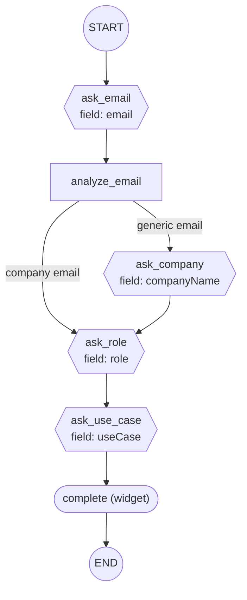

# Visualize Flow

Generate a Mermaid flowchart diagram from a Waniwani SDK flow file.

## Arguments

The user may provide a file path as an argument. If not provided, search for flow files using `**/flows/**/*.ts` patterns and ask the user which one to visualize.

## Steps

### 1. Find and read the flow file

Read the entire flow source file. The flow is defined using the `createFlow` builder pattern with chained `.addNode()`, `.addEdge()`, `.addConditionalEdge()`, and `.compile()` calls.

### 2. Extract the graph structure

Parse the source code to identify:

**Nodes** — Each `.addNode("name", ...)` call. Classify by what the handler returns:
- **Widget node** — handler returns `showWidget({ tool, data })` (or the legacy positional form `showWidget(tool, { data })`). Look for `{ tool: ... }` (object form) or the second positional arg (legacy form).
- **Interrupt node** — handler returns `interrupt({ question, field })`.
- **Action node** — handler returns a plain object like `{}` or `{ key: value }`. These run silently and auto-advance.

**Direct edges** — Each `.addEdge(from, to)` call. `START` and `END` are sentinel constants (`"__start__"` and `"__end__"`).

**Conditional edges** — Each `.addConditionalEdge("from", ["target_a", "target_b"], (state) => { ... })` call. The second argument lists the branch targets verbatim — use it directly. Read the condition body only if you also want to label which state values lead to which target (e.g., `state.country === "FR"`).

### 3. Generate Mermaid diagram

Use `graph TD` (top-down) layout. Apply these shape conventions:

| Node Type | Mermaid Shape | Example |
|-----------|--------------|---------|
| START | Double circle | `START((START))` |
| END | Double circle | `END_NODE((END))` |
| Widget | Stadium/pill | `name(["name (widget)<br/>field: fieldName"])` |
| Interrupt | Hexagon | `name{{"name (interrupt)<br/>field: fieldName"}}` |
| Action/Router | Rectangle | `name["name (action)"]` |

Edge conventions:
- Direct edge: `A --> B`
- Conditional edge: `A -->|"label"| B` — use the condition as label (e.g., `country = FR`, `status = unregistered`, `default`)
- Dead-end edges to END: style with a different arrow if desired

Add a legend comment at the top explaining the shapes.

### 4. Output

Print the full Mermaid diagram as a fenced code block, then copy it to clipboard using `pbcopy`:

```bash
cat <<'EOF' | pbcopy
graph TD
    ...
EOF
```

Confirm to the user that the diagram has been copied.

## Example Output

For a simple 3-step flow:

~~~

~~~

## Important Notes

- Always read the FULL flow file before generating the diagram — don't guess at structure
- For conditional edges, read the actual condition function to extract all branches and labels
- Include ALL nodes and ALL edges — missing nodes means the diagram is incomplete
- Use `END_NODE` as the mermaid node ID for END (since `END` can conflict with mermaid keywords)
- If a node has a `field` in its config or interrupt signal, include it in the node label
- Escape special characters in mermaid labels if needed (quotes, parentheses)
