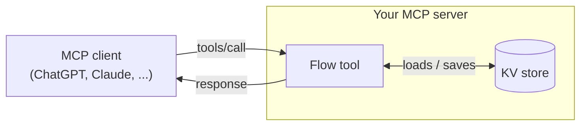
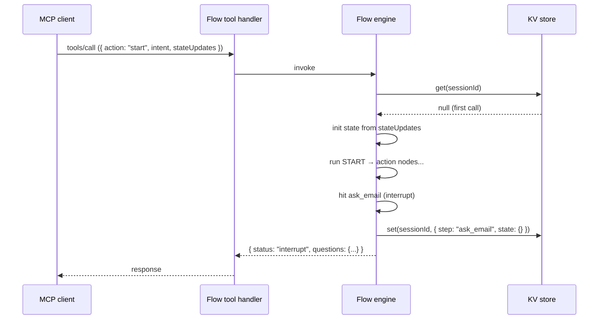
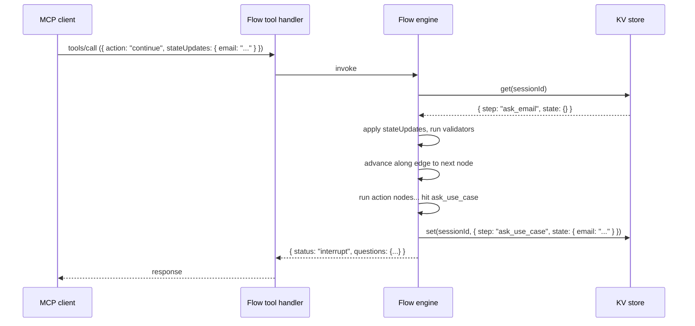

A flow is a single MCP tool. The model calls that tool, the engine drives the graph one step at a time, and the response tells the model whether to ask the user something, render a widget, or stop. Between calls, everything the engine knows about the conversation lives in the KV store, keyed by the MCP session id.

This page walks through one full round-trip. If you understand the picture below, debugging "why doesn't the flow remember what I said?" becomes trivial.

## The pieces



The KV store is the only place the flow engine looks for state between two tool calls. Your MCP server itself can be either stateful (a long-running process, e.g. stdio or single-instance HTTP) or stateless (a serverless function where every call is a fresh process). The engine doesn't assume either — it always requires a `KvStore`. In a stateful runtime, `MemoryKvStore` is enough, because the process holds the state across calls. In a stateless runtime, you need a real backing store (Redis, Upstash, Cloudflare KV, DynamoDB, or `WaniwaniKvStore`) so state survives between cold starts and instances.

## First call: `action: "start"`



After this call, the KV holds:

```json
{
  "step": "ask_email",
  "state": {}
}
```

The flow has paused. The next tool call (with the user's answer) will resume from here.

## Next call: `action: "continue"`



Every `continue` is the same shape: load → apply updates → advance → save → respond.

When the engine reaches `END`, the response status is `"complete"` and the KV key is deleted, so a stale `continue` call can't accidentally resume a finished session.

## What's in the stored value

The value at a given session key is small and deterministic:

```ts
type StoredValue = {
  step: string;                          // current node name (or "END" briefly)
  state: Partial<TState>;                // merged state so far, typed against schema
  pendingWidget?: {                      // present only when paused at a showWidget node
    tool: string;
    data?: Record<string, unknown>;
  };
};
```

Each session maps to one key. The key is derived from the MCP session identifier (`_meta.waniwani/sessionId`, or `Mcp-Session-Id` from the transport). One session, one key, one ongoing flow run.

## What's *not* in the KV store

The KV powers the flow engine only. The following live in a separate pipeline:

- **Tracking events.** `tool.called`, `quote.succeeded`, etc. are emitted by `withWaniwani(server)` and `client.track()`, batched, and POSTed to the events endpoint. Independent of the KV store.
- **Funnel analytics and dashboards.** Built from tracking events on the server side. Reading them never touches your KV.
- **Knowledge base content.** Lives in Waniwani's hosted KB service, unrelated to flow state.

You can self-host the KV and still get hosted dashboards by also calling `withWaniwani(server)` with `WANIWANI_API_KEY` set. The two systems compose.

## Common gotchas

<AccordionGroup>
  <Accordion title="Flow appears to 'forget' between turns">
    The KV reset between calls. Two common causes:

    1. **`MemoryKvStore` in a serverless runtime.** Each invocation is a fresh process, so the in-memory `Map` is empty every time. Use a real backend (Redis, Upstash, Cloudflare KV) or set `WANIWANI_API_KEY` to use `WaniwaniKvStore`.
    2. **Missing session id in `_meta`.** If the MCP client doesn't propagate a session id, the engine derives a different key on every call. `withWaniwani(server)` bridges the transport-level session id into `_meta` for you. Install it.
  </Accordion>

  <Accordion title="Every tool call starts a new flow">
    Same root cause as above (missing or changing session id), but with a different symptom: the engine never finds a stored value, so it always behaves like `action: "start"`. Inspect what your transport puts in `Mcp-Session-Id` and what arrives in `_meta` on the server. They should be stable across a conversation.
  </Accordion>

  <Accordion title="State doesn't match the schema after a deploy">
    You changed the flow's state schema, then deployed. Sessions that were mid-flow have stored values that no longer match the new schema. The safest fix is to invalidate old sessions: delete the prefix in your KV, or version your flow id (`"onboarding_v2"`).
  </Accordion>

  <Accordion title="Concurrent calls on the same session">
    MCP clients serialize calls within a conversation, so concurrent `continue`s on one session are rare. If you see racy reads/writes in your KV, the cause is usually two clients sharing one session id by accident (often a misconfigured proxy). Make sure each conversation has a unique session id.
  </Accordion>

  <Accordion title="Widget never resolves">
    A `showWidget` node stores `pendingWidget` in the KV and returns `status: "widget"`. The engine resumes only when the next `continue` carries `stateUpdates` that fill the `field` declared in `showWidget(...)`. If your display tool never writes that field, the flow stays paused forever. Confirm the display tool's handler is producing the expected key in `stateUpdates`.
  </Accordion>
</AccordionGroup>

## Next

<CardGroup cols={2}>
  <Card title="Nodes" icon="circle-nodes" href="/flows/nodes">
    The three kinds of nodes and the context they receive.
  </Card>
  <Card title="KV store adapters" icon="database" href="/flows/kv-store">
    Pick a backend or write your own in 10 lines.
  </Card>
  <Card title="Tool contract" icon="plug" href="/reference/flow-tool-contract">
    Wire-level reference for `FlowToolInput` and response statuses.
  </Card>
  <Card title="Waniwani Platform" icon="layer-group" href="/platform/overview">
    What runs without an API key, what unlocks when you connect the Platform.
  </Card>
</CardGroup>
