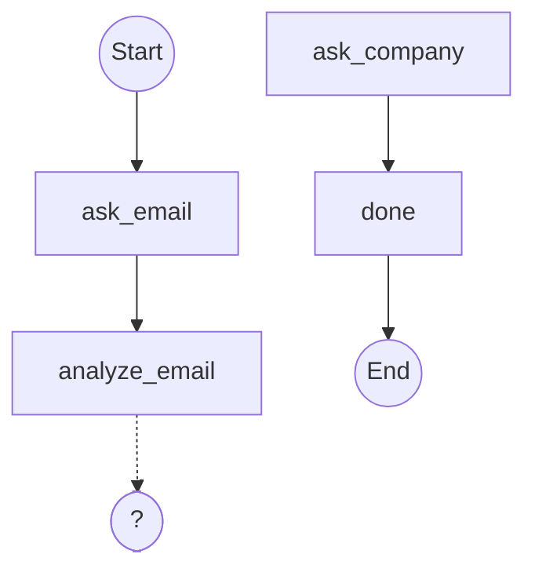

Edges define the order in which your nodes run. A flow without edges is just a collection of handlers; edges are what make it a graph.

## Sentinels: `START` and `END`

Two special node names control where a flow starts and ends:

- **`START`** — the entry point. Every flow must have exactly one edge out of `START`.
- **`END`** — the terminal marker. Any node that should finish the flow points to `END`.

```ts
import { createFlow, START, END } from "@waniwani/sdk/mcp";
```

## Direct edges

The most common edge is a direct one from node A to node B. Use `.addEdge(from, to)`:

```ts
flow
  .addEdge(START, "ask_email")
  .addEdge("ask_email", "ask_use_case")
  .addEdge("ask_use_case", "record")
  .addEdge("record", END);
```

Each node can have **at most one outgoing edge**. If you need the flow to branch, use a conditional edge.

<Warning>
  Calling `addEdge` twice from the same node throws at build time. Replace the second `addEdge` with `addConditionalEdge` if you need branching.
</Warning>

## Conditional edges

Use `addConditionalEdge` when the next step depends on the current state. The condition function receives the current state (partial, as always) and returns the name of the next node.

```ts
flow
  .addNode("ask_email", async ({ interrupt }) =>
    interrupt({ email: { question: "What's your email?" } }),
  )
  .addNode("analyze_email", ({ state }) => {
    const domain = state.email?.split("@")[1] ?? "";
    const generic = new Set(["gmail.com", "yahoo.com", "outlook.com"]);
    return { isCompanyEmail: !generic.has(domain) };
  })
  .addNode("ask_company", async ({ interrupt }) =>
    interrupt({ companyName: { question: "What company are you with?" } }),
  )
  .addNode("done", () => ({ ready: true }))
  .addEdge(START, "ask_email")
  .addEdge("ask_email", "analyze_email")
  .addConditionalEdge("analyze_email", (state) =>
    state.isCompanyEmail ? "done" : "ask_company",
  )
  .addEdge("ask_company", "done")
  .addEdge("done", END);
```

The condition function can be `async` — handy when the branch depends on an external lookup.

```ts
.addConditionalEdge("check_inventory", async (state) => {
  const inStock = await inventoryService.check(state.sku);
  return inStock ? "confirm_order" : "offer_alternative";
})
```

## Reaching `END`

A flow ends when execution reaches `END`. At that point, the engine returns a `complete` status to the model and deletes the session's flow state.

Any node can point to `END`:

```ts
.addEdge("confirmation", END)
```

You can also branch to `END` conditionally:

```ts
.addConditionalEdge("review", (state) =>
  state.approved ? END : "ask_corrections",
)
```

## Validation at compile time

When you call `.compile()`, the engine validates the graph:

- **Entry point exists.** There must be an edge from `START`.
- **All static edge targets exist.** No dangling references to undeclared nodes.
- **Every node has an outgoing edge.** A node without an outgoing edge is a dead end — the engine throws at compile time rather than at runtime.

If validation fails, `.compile()` throws a descriptive error before your server ever starts.

## Visualizing the graph

Every flow exposes a `graph()` method that returns a Mermaid `flowchart TD` string. Drop it into documentation, a debug panel, or a GitHub README:

```ts
console.log(flow.graph());
```

Direct edges render as solid arrows; conditional edges render as dashed arrows to a placeholder (because their target is decided at runtime).



## Loops

There's nothing special about loops — a conditional edge that points back to an earlier node creates one. Use them for retry logic, collection gathering, or "are you sure?" confirmations.

```ts
.addNode("ask_item", async ({ interrupt }) =>
  interrupt({ item: { question: "Add an item (or type 'done')" } }),
)
.addNode("append", ({ state }) => ({
  items: [...(state.items ?? []), state.item].filter(Boolean),
}))
.addConditionalEdge("append", (state) =>
  state.item === "done" ? "finalize" : "ask_item",
)
```

<Warning>
  The engine does not enforce a maximum loop count. If your loop condition never terminates, the flow will too — make sure every path eventually reaches `END`.
</Warning>
