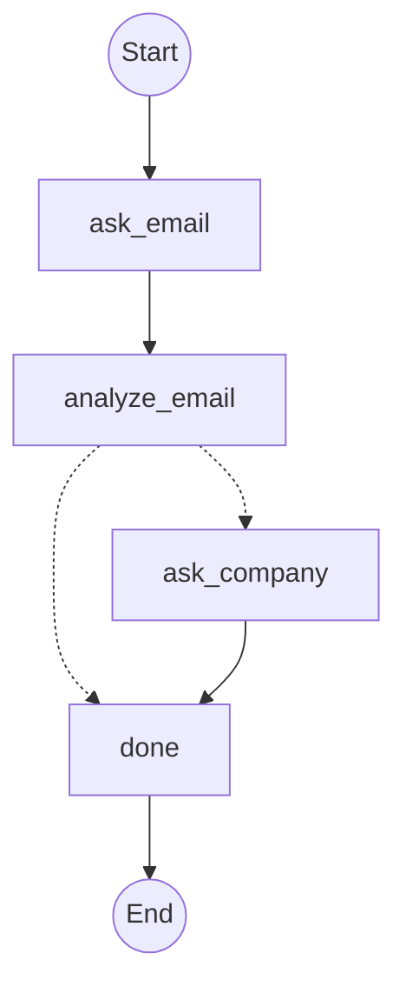

Edges define the order in which nodes run. Every node needs an outgoing edge. Every flow needs an edge out of `START` and must be able to reach `END`.

## Sentinels

Two reserved node names control flow boundaries:

- `START`: the entry point. Exactly one edge must originate from it.
- `END`: the terminal marker. Any node pointing to `END` finishes the flow when reached.

```ts
import { createFlow, END, START } from "@waniwani/sdk/mcp";
```

## Direct edges

Use `.addEdge(from, to)` for unconditional transitions. Each node can have at most one outgoing edge.

```ts
flow
  .addEdge(START, "ask_email")
  .addEdge("ask_email", "ask_use_case")
  .addEdge("ask_use_case", "record")
  .addEdge("record", END);
```

<Warning>
  Calling `addEdge` twice from the same node throws at build time. If you need a second outgoing path, replace the first call with `addConditionalEdge`.
</Warning>

## Conditional edges

Use `.addConditionalEdge(from, to, condition)` when the next node depends on state. Declare every node the branch can reach in the `to` array, then `condition` receives `Partial<TState>` and returns which of those nodes to go to next. It can be async.

The condition's return type is **constrained to `to`** — returning a node you did not list is a compile error. Because `to` is the declared set of targets, graph introspection (funnel analytics, Mermaid diagrams) reads it directly, so the graph stays correct even when the branch target is computed dynamically.

```ts
flow
  .addNode({
    id: "ask_email",
    run: ({ interrupt }) =>
      interrupt({ email: { question: "What's your email?" } }),
  })
  .addNode({
    id: "analyze_email",
    run: ({ state }) => {
      const domain = state.email?.split("@")[1] ?? "";
      const generic = new Set(["gmail.com", "yahoo.com", "outlook.com"]);
      return { isCompanyEmail: !generic.has(domain) };
    },
  })
  .addNode({
    id: "ask_company",
    run: ({ interrupt }) =>
      interrupt({ companyName: { question: "What company are you with?" } }),
  })
  .addNode({ id: "done", run: () => ({ ready: true }) })
  .addEdge(START, "ask_email")
  .addEdge("ask_email", "analyze_email")
  .addConditionalEdge("analyze_email", ["done", "ask_company"], (state) =>
    state.isCompanyEmail ? "done" : "ask_company",
  )
  .addEdge("ask_company", "done")
  .addEdge("done", END);
```

Async conditions work for branches that depend on external lookups:

```ts
.addConditionalEdge(
  "check_inventory",
  ["confirm_order", "offer_alternative"],
  async (state) => {
    const inStock = await inventoryService.check(state.sku!);
    return inStock ? "confirm_order" : "offer_alternative";
  },
)
```

The return type is checked against the `to` list, so a typo in a branch target — or a target you forgot to declare — fails type-checking.

## Reaching END

When execution reaches `END`, the engine returns `status: "complete"` to the model and deletes the session's flow state so a stale `continue` call cannot resume it. Any node can point to `END`, directly or conditionally.

```ts
.addConditionalEdge("review", [END, "ask_corrections"], (state) =>
  state.approved ? END : "ask_corrections",
)
```

## Loops

A conditional edge that points back to an earlier node creates a loop. Useful for retries or collection gathering.

```ts
.addNode({
  id: "ask_item",
  run: ({ interrupt }) =>
    interrupt({ item: { question: "Add an item (or say 'done')" } }),
})
.addNode({
  id: "append",
  run: ({ state }) => ({
    items: [...(state.items ?? []), state.item].filter(Boolean) as string[],
  }),
})
.addEdge("ask_item", "append")
.addConditionalEdge("append", ["finalize", "ask_item"], (state) =>
  state.item === "done" ? "finalize" : "ask_item",
)
```

The engine enforces a hard cap of 50 iterations per tool call to prevent runaway loops between action nodes. You will still need `END` reachable from every branch or the flow can stall.

## Compile-time validation

`.compile()` validates the graph before returning. It throws if:

- No edge exists from `START`.
- A `START` edge or direct edge points at an undeclared node.
- A conditional edge declares a `to` target that is not a registered node.
- A conditional edge declares an empty `to` list.
- A node has no outgoing edge.
- An edge is declared `from` a non-existent node.

Errors surface immediately at startup, not at the first user interaction.

## Visualizing the graph

Both the builder and the compiled flow expose `graph()`, which returns a Mermaid `flowchart TD` string. Conditional edges render one dashed arrow per declared `to` target.

```ts
console.log(flow.graph());
```


