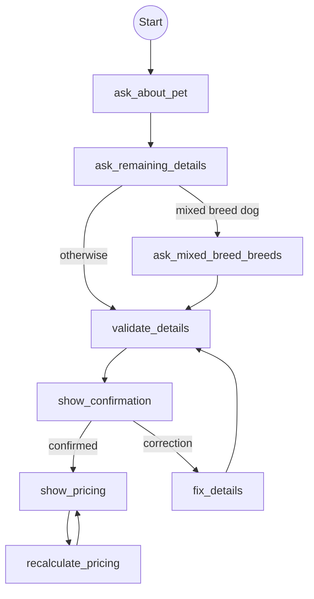

This example is a simplified version of a production pet insurance quoting flow. It demonstrates how flows handle complex, multi-step conversations that feel natural, not like filling out a form.

<Note>
API calls use a fictional `petApi` for clarity. The patterns and architecture are real.
</Note>

## Flow graph



## Patterns demonstrated

<CardGroup cols={2}>
  <Card title="Open-ended questions" icon="comments">
    One natural question extracts multiple state fields at once.
  </Card>
  <Card title="Conversational follow-ups" icon="message">
    Asks remaining questions 1-2 at a time with warm, contextual reactions.
  </Card>
  <Card title="Rich system prompt" icon="scroll">
    Compliance rules and tone guidance embedded in the tool description.
  </Card>
  <Card title="Conditional branching" icon="code-branch">
    Different paths based on animal type and breed composition.
  </Card>
  <Card title="Async validation" icon="check-double">
    Server-side breed and location validation between questions and confirmation.
  </Card>
  <Card title="Widget display" icon="window-maximize">
    Confirmation card and pricing cards rendered via display tools.
  </Card>
  <Card title="Correction loop" icon="rotate-left">
    User fixes details → re-validate → re-display until confirmed.
  </Card>
  <Card title="Pricing adjustment loop" icon="sliders">
    User tweaks deductible/copay → recalculate → show updated prices.
  </Card>
</CardGroup>

## Full flow

```ts
import { createFlow, END, START } from "@waniwani/sdk/mcp";
import { z } from "zod";
import { petApi } from "./api";
import { showPetSummaryTool, showPricingTool } from "./display-tools";

export const quoteFlow = createFlow({
  id: "pet_insurance_quote",
  title: "Pet Insurance Quote",
  description: `Get a pet insurance quote. Use when a user wants to insure their dog or cat, get a price quote, or learn about available insurance packages.

NO-RECOMMENDATION RULE (CRITICAL - applies to the ENTIRE conversation):
- NEVER recommend, suggest, or steer the user toward any specific plan, not even implicitly.
- NEVER use social proof ("most people choose…") or comparative framing ("best protection…").
- When asked "what do you recommend?", warmly decline: explain you can only provide factual information, and invite them to ask about coverage details so they can decide themselves.
- When comparing plans, present ONLY factual differences (price, limits, what's included).

TONE - conversational, not a form:
- You are a warm, knowledgeable assistant, like a friend who happens to know everything about pet insurance.
- React to what the user shares with genuine interest (e.g., "Goldens are such great dogs!")
- Use the pet's name once you know it.
- Keep text short. Use widgets for structured information.
- Explain difficult concepts simply, avoid insurance jargon.

DO: Talk like a friend. React genuinely. Be frank and truthful.
DON'T: Sound sales-y. Be judgmental. Use walls of text. Be robotic.`,
  state: {
    animalType: z
      .enum(["dog", "cat"])
      .describe(
        "Type of animal. Infer from the breed when obvious (e.g. Golden Retriever → dog, Persian → cat).",
      ),
    petName: z.string().describe("The pet's name"),
    breed: z
      .string()
      .describe(
        "The pet's breed as stated by the user. Fix obvious spelling mistakes (e.g. 'Retriver' → 'Retriever'). Leave empty when isMixedBreed is true.",
      ),
    breedId: z
      .string()
      .describe("Resolved breed ID from the API (set by validation, not the user)"),
    isMixedBreed: z
      .boolean()
      .optional()
      .describe(
        "Whether the pet is a mixed breed. Set to true when user mentions a mix, crossbreed, or multiple breeds. When setting to true, MUST also set mixedBreed to {} in the same stateUpdates.",
      ),
    mixedBreed: z
      .object({
        knowsBreeds: z
          .boolean()
          .describe("true if user named at least one breed, false if they don't know"),
        breed1: z.string().optional().describe("First breed in the mix"),
        breed1Id: z.string().optional().describe("First breed API ID (set by system)"),
        breed2: z.string().optional().describe("Second breed in the mix (optional)"),
        breed2Id: z.string().optional().describe("Second breed API ID (set by system)"),
      })
      .optional()
      .describe(
        "MUST be set whenever isMixedBreed is true. If user named breeds: { knowsBreeds: true, breed1: '...', breed2: '...' }. If user just said 'mixed' without naming breeds: { knowsBreeds: false }.",
      ),
    gender: z
      .enum(["male", "female"])
      .describe(
        "The pet's gender. Infer from pronouns: he/him/his → male, she/her → female. Also accept boy/girl.",
      ),
    isNeutered: z.boolean().describe("Whether the pet is neutered/spayed"),
    birthDate: z
      .string()
      .describe(
        "Birth date in YYYY-MM-DD format. Accept any format from the user ('2 years old', 'March 2023', etc.) and convert yourself. Never ask the user to reformat.",
      ),
    indoorOutdoor: z
      .enum(["indoor", "outdoor"])
      .optional()
      .describe("Whether the cat is indoor or outdoor (cats only, skip for dogs)"),
    municipality: z.string().describe("City or municipality where the owner lives"),
    isCurrentlyInsured: z
      .enum(["yes", "no"])
      .describe("Whether the pet is currently insured with another provider"),
    confirmed: z.boolean().describe("Whether the user confirmed their pet details"),
    quoteId: z.string().describe("Quote ID returned by the pricing API"),
    deductible: z
      .number()
      .optional()
      .describe("Fixed deductible amount. Default: 500. Options: 0, 250, 500, 750."),
    copay: z
      .number()
      .optional()
      .describe(
        "Copay percentage as decimal. Default: 0.20. Options: 0.15 (15%), 0.20 (20%), 0.25 (25%).",
      ),
    pricingAction: z
      .enum(["adjust", "done"])
      .describe(
        "Set to 'adjust' when user wants to change deductible/copay. Set to 'done' when satisfied.",
      ),
  },
})

  // ─── Node 1: Open-ended question ─────────────────────────────────────
  // One natural question → extract as many fields as possible from free-form text
  .addNode({
    id: "ask_about_pet",
    run: ({ interrupt }) => {
      return interrupt({
        petName: {
          question: "Tell me about your pet!",
          context: `Warmly greet the user and ask an OPEN-ENDED question. Something like:
"I'd love to help you explore insurance options! Tell me a bit about your pet - what kind of animal, their name, breed, age… anything you'd like to share :)"

Do NOT list specific questions. Let the user share naturally.

From their response, extract as many fields as possible into stateUpdates:
- animalType: infer from breed when obvious
- petName, breed, gender (from pronouns), isNeutered, birthDate (any format → YYYY-MM-DD)
- isCurrentlyInsured, municipality
- isMixedBreed + mixedBreed if they mention a mix

Only extract what is clearly stated. Do NOT guess missing fields.`,
        },
      });
    },
  })

  // ─── Node 2: Conversational follow-ups ───────────────────────────────
  // Only ask what's still missing, 1-2 questions at a time
  .addNode({
    id: "ask_remaining_details",
    run: async ({ state, interrupt }) => {
    const breedList = await petApi.getBreedList(state.animalType);

    const sharedContext = `You're having a natural conversation, NOT filling out a form. Ask remaining questions ONE OR TWO at a time, weaving them in naturally. React to what the user shared previously with genuine interest before asking the next thing.

Good follow-ups:
- "Love that name! And what breed is ${state.petName}?"
- "A Golden Retriever, great choice! Is ${state.petName} a boy or a girl?"
- "Got it! And roughly how old is ${state.petName}?"

${breedList ? `Valid breed names: ${breedList}. Match the user's input to the closest name from this list.` : ""}

IMPORTANT: Do NOT ask all remaining questions at once. Keep it conversational.
FORMATTING: Write in flowing prose, not bullet points.`;

    return interrupt(
      {
        ...(!state.animalType
          ? { animalType: { question: "Is it a dog or a cat?" } }
          : {}),
        ...(!state.petName
          ? { petName: { question: "What's your pet's name?" } }
          : {}),
        ...(!state.breed && !state.isMixedBreed
          ? {
              breed: {
                question: "What breed?",
                context: breedList
                  ? `Valid breeds: ${breedList}. Match the user's input to the closest official name.`
                  : undefined,
                validate: state.animalType
                  ? async (breed: string) => {
                      return petApi.validateBreed(state.animalType!, breed);
                    }
                  : undefined,
              },
            }
          : {}),
        ...(!state.gender ? { gender: { question: "Male or female?" } } : {}),
        ...(state.isNeutered == null
          ? { isNeutered: { question: "Neutered/spayed?" } }
          : {}),
        ...(!state.birthDate
          ? { birthDate: { question: "When was your pet born?" } }
          : {}),
        ...(!state.isCurrentlyInsured
          ? { isCurrentlyInsured: { question: "Currently insured?" } }
          : {}),
        ...(!state.municipality
          ? { municipality: { question: "What city do you live in?" } }
          : {}),
        ...(state.animalType === "cat" && !state.indoorOutdoor
          ? { indoorOutdoor: { question: "Indoor or outdoor cat?" } }
          : {}),
      },
      { context: sharedContext },
    );
    },
  })

  // ─── Node 3: Mixed breed - collect breed names ───────────────────────
  .addNode({
    id: "ask_mixed_breed_breeds",
    run: async ({ state, interrupt }) => {
      if (!state.isMixedBreed || state.mixedBreed?.breed1) return {};

      const breedList = await petApi.getBreedList(state.animalType);

      return interrupt({
        "mixedBreed.breed1": {
          question: "Which breeds is your dog a mix of?",
          context: `Ask naturally: "Which breeds is ${state.petName} a mix of?" They must provide at least one, the second is optional.${breedList ? `\n\nValid breeds: ${breedList}. Match each to the closest official name.` : ""}`,
          validate: async (breed1) => {
            if (!breed1) return;
            return petApi.validateMixedBreed(state.animalType!, {
              ...state.mixedBreed,
              breed1,
            });
          },
        },
      });
    },
  })

  // ─── Node 4: Validate breed + location against API ───────────────────
  .addNode({
    id: "validate_details",
    run: async ({ state }) => {
      const [breedResult, locationResult] = await Promise.all([
        state.isMixedBreed && state.mixedBreed
          ? petApi.validateMixedBreed(state.animalType!, state.mixedBreed)
          : petApi.validateBreed(state.animalType!, state.breed!),
        petApi.validateLocation(state.municipality!),
      ]);

      return { ...breedResult, ...locationResult };
    },
  })

  // ─── Node 5: Show confirmation widget ────────────────────────────────
  .addNode({
    id: "show_confirmation",
    run: ({ state, showWidget }) => {
      const mb = state.mixedBreed;
      let displayBreed = state.breed ?? "";
      if (mb) {
        const parts = [mb.breed1, mb.breed2].filter(Boolean);
        displayBreed = parts.length > 0 ? `${parts.join(" & ")} Mix` : "Mixed breed";
      }

      return showWidget("show_pet_summary", {
        field: "confirmed",
        description:
          "You MUST now call the show_pet_summary tool with the pet data to display the summary card. Write a short, excited message first, something like 'Here's what I've got for [petName], take a look!' Then immediately call show_pet_summary. The widget displays all the details, so do NOT repeat them in your text. After the widget renders, ask the user to confirm or let you know if anything needs fixing. If the user corrects anything, set confirmed to false and extract the correction. Only set confirmed to true when they explicitly say everything is correct.",
        data: {
          animalType: state.animalType,
          petName: state.petName,
          breed: displayBreed,
          gender: state.gender,
          isNeutered: state.isNeutered,
          birthDate: state.birthDate,
          indoorOutdoor: state.indoorOutdoor,
          municipality: state.municipality,
        },
      });
    },
  })

  // ─── Node 5b: Reset confirmed for correction loop ───────────────────
  .addNode({
    id: "fix_details",
    run: () => ({ confirmed: undefined }),
  })

  // ─── Node 6: Show pricing widget ────────────────────────────────────
  .addNode({
    id: "show_pricing",
    run: async ({ state, showWidget }) => {
      const currentDeductible = state.deductible ?? 500;
      const currentCopay = state.copay ?? 0.2;

      const quote = await petApi.getQuote({
        animalType: state.animalType!,
        breedId: state.breedId!,
        birthDate: state.birthDate!,
        gender: state.gender!,
        neutered: !!state.isNeutered,
        municipality: state.municipality!,
        deductible: currentDeductible,
        copay: currentCopay,
      });

      return {
        quoteId: quote.id,
        ...showWidget("show_pricing", {
          description: `You MUST now call the show_pricing tool with the plans data to display the pricing cards. Write a brief intro, something like "Here are the plans available for [petName]!" Then immediately call show_pricing. COMPLIANCE: Do NOT recommend any plan. Only present factual differences. After the widget renders, let the user browse. If they want to adjust their deductible (options: 0, 250, 500, 750) or copay (options: 15%, 20%, 25%), set the new values and set pricingAction to "adjust". If they're happy, set pricingAction to "done".`,
          data: {
            petName: state.petName,
            quoteId: quote.id,
            plans: quote.plans,
          },
        }),
      };
    },
  })

  // ─── Node 6b: Reset pricingAction for adjustment loop ───────────────
  .addNode({
    id: "recalculate_pricing",
    run: () => ({ pricingAction: undefined as unknown as "adjust" | "done" }),
  })

  // ─── Edges ──────────────────────────────────────────────────────────
  .addEdge(START, "ask_about_pet")
  .addEdge("ask_about_pet", "ask_remaining_details")
  .addConditionalEdge("ask_remaining_details", (state) => {
    if (state.animalType === "dog" && state.isMixedBreed)
      return "ask_mixed_breed_breeds";
    return "validate_details";
  })
  .addEdge("ask_mixed_breed_breeds", "validate_details")
  .addEdge("validate_details", "show_confirmation")
  .addConditionalEdge("show_confirmation", (state) =>
    state.confirmed ? "show_pricing" : "fix_details",
  )
  .addEdge("fix_details", "validate_details")
  .addEdge("show_pricing", "recalculate_pricing")
  .addEdge("recalculate_pricing", "show_pricing")
  .compile();
```

## Register the widget display tools

`showWidget("show_pet_summary", ...)` and `showWidget("show_pricing", ...)` in the flow refer to tool IDs the model will call to render each widget. Register them directly on the MCP server alongside the flow:

```ts
import { z } from "zod";

server.registerTool(
  "show_pet_summary",
  {
    title: "Show Pet Summary",
    description: "Displays a confirmation card with the pet's details.",
    inputSchema: {
      animalType: z.enum(["dog", "cat"]),
      petName: z.string(),
      breed: z.string(),
      gender: z.enum(["male", "female"]),
      isNeutered: z.boolean(),
      birthDate: z.string(),
      indoorOutdoor: z.enum(["indoor", "outdoor"]).optional(),
      municipality: z.string(),
    },
    _meta: {
      "openai/outputTemplate": "ui://widget/pet-summary",
    },
  },
  async (input) => ({
    content: [{ type: "text", text: `Pet summary for ${input.petName}` }],
    structuredContent: input,
  }),
);

server.registerTool(
  "show_pricing",
  {
    title: "Show Pricing Plans",
    description: "Displays a scrollable grid of insurance plan cards.",
    inputSchema: {
      petName: z.string(),
      quoteId: z.string(),
      plans: z.array(
        z.object({
          name: z.string(),
          monthlyPrice: z.number(),
          coverageLimit: z.number(),
          deductible: z.number(),
          copay: z.number(),
          highlights: z.array(z.string()),
        }),
      ),
    },
    _meta: {
      "openai/outputTemplate": "ui://widget/pricing",
    },
  },
  async (input) => ({
    content: [{ type: "text", text: `Pricing for ${input.petName}` }],
    structuredContent: input,
  }),
);
```

The widget itself is wired through the tool's `_meta.openai/outputTemplate` (or the equivalent client-specific widget metadata). `withWaniwani(server)` will forward that metadata into every tool result so chat UIs render the widget automatically.

## Registration

```ts
import { quoteFlow } from "./flows/quote";

// Register the flow (compiles into a single MCP tool)
await quoteFlow.register(server);

// Register the widget display tools above with server.registerTool(...).
```

## Key patterns explained

<AccordionGroup>
  <Accordion title="Why the system prompt lives in description">
    The `description` field of a flow becomes the MCP tool's description. It's the first thing the model reads when deciding how to use the tool. By embedding compliance rules and tone guidance here, you ensure **every single interaction** follows your guidelines without relying on external system prompts you don't control.

    This is especially powerful for regulated industries (insurance, finance, healthcare) where the AI must never give recommendations or advice.
  </Accordion>

  <Accordion title="How open-ended extraction works">
    The `ask_about_pet` node asks one broad question but declares `petName` as its interrupt field. The `context` instructs the model to extract **all** recognizable fields from the user's free-form response into `stateUpdates`.

    This creates the feeling of a natural conversation: the user says "I have a 2-year-old Golden Retriever named Max, he's neutered" and the flow captures 5+ fields in one turn. The next node then only asks what's still missing.
  </Accordion>

  <Accordion title="The correction loop pattern">
    After `show_confirmation` displays the summary widget:
    - If the user says "looks good" → `confirmed = true` → proceed to pricing
    - If the user says "actually his name is Max, not Mac" → `confirmed = false` + correction in stateUpdates → `fix_details` resets confirmed → `validate_details` re-runs → `show_confirmation` re-displays with corrected data

    This loop continues until the user explicitly confirms. The flow never proceeds with incorrect data.
  </Accordion>

  <Accordion title="The pricing adjustment loop">
    After showing pricing plans, the user might say "can I see prices with a lower deductible?" The model sets the new deductible value and `pricingAction: "adjust"`. The `recalculate_pricing` node resets `pricingAction` to `undefined`, which loops back to `show_pricing`, which calls the API with the new parameters and re-renders the widget.

    This pattern works for any "configure → preview → adjust" cycle.
  </Accordion>

  <Accordion title="How flows call widgets (the showWidget handoff)">
    Flows don't render widgets directly. Instead, `showWidget` creates a special interrupt that **instructs the LLM to call a separate display tool**. Here's the sequence:

    1. The flow node calls `showWidget("show_pricing", { description, data })` and pauses.
    2. The flow engine returns an interrupt to the LLM with the `description` you provided.
    3. The LLM reads that description (which says "You MUST now call the `show_pricing` tool"), writes a short intro message, then calls the display tool.
    4. The display tool renders the widget in the chat UI.
    5. After the user interacts with the widget, the LLM continues the flow with updated state.

    The `description` is the key bridge. It's your instruction to the LLM about **what tool to call and how to frame it conversationally**. This is why it says things like "Write a brief intro, then immediately call show_pet_summary" rather than just describing what the widget does.

    The `field` parameter tells the flow which state field the widget interaction resolves (e.g., `confirmed`). The `data` is passed directly to the widget component for rendering.

    ```ts
    // The flow pauses here and tells the LLM:
    // "Call show_pet_summary with this data"
    return showWidget("show_pet_summary", {
      field: "confirmed",  // Which state field this resolves
      description: "You MUST now call the show_pet_summary tool...",
      data: { petName, breed, ... },  // Passed to the widget
    });
    ```

    This separation means the flow controls **when** and **with what data** a widget appears, while the LLM controls the **conversational framing** around it.
  </Accordion>

  <Accordion title="Validate callbacks for real-time enrichment">
    The `breed` interrupt field in `ask_remaining_details` has a `validate` callback:

    ```ts
    validate: async (breed: string) => {
      return petApi.validateBreed(state.animalType!, breed);
    }
    ```

    This runs server-side when the model provides a breed name. If the breed doesn't exist in the database, the validation throws an error with suggestions and the flow automatically re-asks the user. If it succeeds, it can return state updates (like `breedId`) that enrich the state without an extra round-trip.
  </Accordion>
</AccordionGroup>
