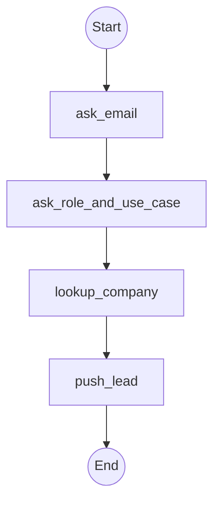

This page shows you how to **build a lead generation MCP funnel** with `@waniwani/sdk`. Lead gen is the simplest MCP funnel: a few questions, validation, and a handoff. Runs as a single MCP tool inside any MCP client.

## What you'll build

A lead capture flow that:

1. Asks for **work email**, with format validation
2. Asks for **role** and **use case**
3. Looks up the company by email domain (action node, no user prompt)
4. Pushes to your **CRM or webhook**

## Flow graph



## Code

```ts
import { createFlow, START, END } from "@waniwani/sdk/mcp";
import { z } from "zod";
import { crm, enrichment } from "./services";

export const leadGenFunnel = createFlow({
  id: "lead_generation",
  title: "Lead Generation",
  description: "Use when a visitor expresses interest and we need to capture them as a lead. Collects email, role, and use case, then pushes to CRM.",
  state: {
    email: z.string().describe("Work email, used to identify the lead"),
    role: z.string().describe("Role at company (e.g. 'PM', 'Engineering Manager')"),
    useCase: z.string().describe("What they want to build or solve"),
    company: z.string().optional().describe("Company name, enriched from email domain"),
    leadId: z.string().optional().describe("CRM lead ID, set after push"),
  },
})
  .addNode({
    id: "ask_email",
    label: "Ask for email",
    run: ({ interrupt }) =>
      interrupt({
        email: {
          question: "What's your work email?",
          validate: (email: string) => {
            if (!/^[^\s@]+@[^\s@]+\.[^\s@]+$/.test(email)) {
              throw new Error("Please share a valid work email.");
            }
          },
        },
      }),
  })
  .addNode({
    id: "ask_role_and_use_case",
    label: "Ask role + use case",
    run: ({ interrupt }) =>
      interrupt({
        role: { question: "What's your role?" },
        useCase: {
          question: "What are you hoping to build?",
          suggestions: [
            "Customer support",
            "Lead capture / sales",
            "Internal tools",
            "Something else",
          ],
        },
      }),
  })
  .addNode({
    id: "lookup_company",
    label: "Enrich from email",
    hideFromFunnel: true,
    run: async ({ state }) => {
      const enriched = await enrichment.lookupByEmail(state.email);
      return { company: enriched?.company };
    },
  })
  .addNode({
    id: "push_lead",
    label: "Push to CRM",
    run: async ({ state }) => {
      const lead = await crm.createLead({
        email: state.email,
        role: state.role,
        useCase: state.useCase,
        company: state.company,
      });
      return { leadId: lead.id };
    },
  })
  .addEdge(START, "ask_email")
  .addEdge("ask_email", "ask_role_and_use_case")
  .addEdge("ask_role_and_use_case", "lookup_company")
  .addEdge("lookup_company", "push_lead")
  .addEdge("push_lead", END)
  .compile();
```

## Register

```ts
await leadGenFunnel.register(server);
```

## Why this works as an MCP funnel

- **No form, no friction.** The user is already in ChatGPT or Claude. They never leave.
- **The AI asks the questions in plain language.** Better completion rate than a form.
- **Validation runs server-side.** If the email is malformed, the engine re-asks automatically.
- **Enrichment happens silently.** `lookup_company` is an action node, no user interaction.

## Add funnel analytics

Set `WANIWANI_API_KEY` and every step is tracked. The funnel view shows three steps: **Ask for email → Ask role + use case → Push to CRM** (the labels are taken from each node's `label` field). `lookup_company` uses `hideFromFunnel: true` because enrichment is plumbing, not a step the user can drop off at. See [Tracking / Overview](/tracking/overview).

## Next

<CardGroup cols={2}>
  <Card title="Build a sales funnel MCP" icon="filter" href="/funnels/sales-funnel" />
  <Card title="Build a booking MCP app" icon="calendar" href="/funnels/booking" />
  <Card title="Validation in interrupts" icon="check-double" href="/flows/interrupts" />
  <Card title="Push events to your stack" icon="webhook" href="/tracking/events" />
</CardGroup>
