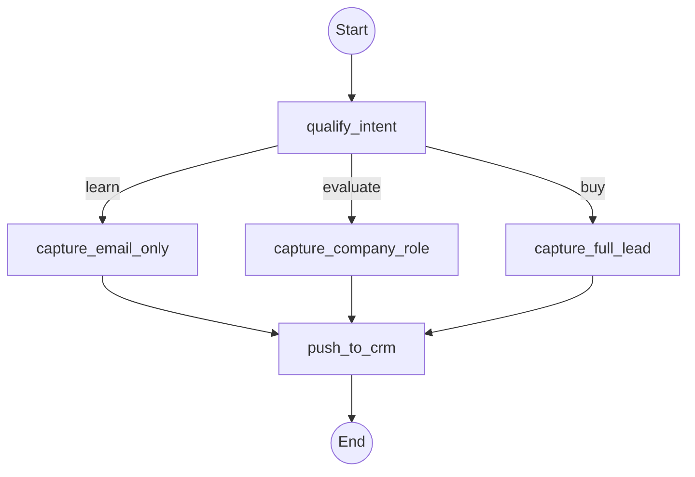

This page shows you how to **build a sales funnel MCP app** with `@waniwani/sdk`. The funnel runs as a single MCP tool inside ChatGPT, Claude, or any MCP client. The engine handles state and branching server-side.

## What you'll build

A sales funnel that:

1. **Qualifies intent**: learn, evaluate, or buy
2. **Captures lead info**: email, company, role, team size
3. **Branches by stage**: different next steps for "evaluating" vs. "ready to buy"
4. **Hands off to your CRM**: call your API in the last action node

## Flow graph



## Code

```ts
import { createFlow, START, END } from "@waniwani/sdk/mcp";
import { z } from "zod";
import { crm } from "./crm";

export const salesFunnel = createFlow({
  id: "sales_funnel",
  title: "Sales Funnel",
  description: `Use when a visitor wants to learn more about the product, evaluate it for their team, or buy. Qualify intent first, then capture the right lead information for the stage.`,
  state: {
    intent: z.enum(["learn", "evaluate", "buy"]).describe("Stage of buyer journey"),
    email: z.string().describe("Work email"),
    company: z.string().optional().describe("Company name"),
    role: z.string().optional().describe("Role at company"),
    teamSize: z.string().optional().describe("Team size (e.g. '1-10', '11-50', '50+')"),
    leadId: z.string().optional().describe("CRM lead ID (set after push)"),
  },
})
  .addNode({
    id: "qualify_intent",
    label: "Qualify intent",
    run: ({ interrupt }) =>
      interrupt({
        intent: {
          question: "What brings you here today?",
          suggestions: [
            "Just learning about the product",
            "Evaluating for my team",
            "Ready to buy",
          ],
        },
      }),
  })
  .addNode({
    id: "capture_email_only",
    label: "Capture email",
    run: ({ interrupt }) =>
      interrupt({ email: { question: "What's your work email?" } }),
  })
  .addNode({
    id: "capture_company_role",
    label: "Capture company + role",
    run: ({ interrupt }) =>
      interrupt({
        email: { question: "Work email?" },
        company: { question: "Which company?" },
        role: { question: "What's your role?" },
      }),
  })
  .addNode({
    id: "capture_full_lead",
    label: "Capture full lead",
    run: ({ interrupt }) =>
      interrupt({
        email: { question: "Work email?" },
        company: { question: "Which company?" },
        role: { question: "What's your role?" },
        teamSize: { question: "How big is your team?" },
      }),
  })
  .addNode({
    id: "push_to_crm",
    label: "Push to CRM",
    run: async ({ state }) => {
      const lead = await crm.createLead({
        email: state.email,
        company: state.company,
        role: state.role,
        teamSize: state.teamSize,
        stage: state.intent,
      });
      return { leadId: lead.id };
    },
  })
  .addEdge(START, "qualify_intent")
  .addConditionalEdge("qualify_intent", (state) => {
    if (state.intent === "learn") return "capture_email_only";
    if (state.intent === "evaluate") return "capture_company_role";
    return "capture_full_lead";
  })
  .addEdge("capture_email_only", "push_to_crm")
  .addEdge("capture_company_role", "push_to_crm")
  .addEdge("capture_full_lead", "push_to_crm")
  .addEdge("push_to_crm", END)
  .compile();
```

## Register on your MCP server

```ts
import { McpServer } from "@modelcontextprotocol/sdk/server/mcp.js";
import { salesFunnel } from "./flows/sales-funnel";

const server = new McpServer({ name: "my-mcp", version: "0.0.1" });
await salesFunnel.register(server);
```

That's it. The funnel is now a tool the AI client can call. The engine runs the graph, pauses on interrupts, branches by intent, and calls your CRM in `push_to_crm`.

## Patterns this uses

- **Conditional edges.** Different paths by `intent`. See [Flows / Edges](/flows/edges).
- **Multi-field interrupts.** Capture several fields per turn. See [Flows / Interrupts](/flows/interrupts).
- **Action nodes.** `push_to_crm` runs without user interaction. See [Flows / Nodes](/flows/nodes).

## Add funnel analytics

Set `WANIWANI_API_KEY` and every node visit is tracked. The dashboard shows step-by-step drop-off across `qualify_intent → capture_* → push_to_crm`. See [Tracking / Overview](/tracking/overview).

## Next

<CardGroup cols={2}>
  <Card title="Build a lead generation MCP" icon="user-plus" href="/funnels/lead-generation" />
  <Card title="Build a booking MCP app" icon="calendar" href="/funnels/booking" />
  <Card title="Build an insurance quote MCP" icon="shield" href="/funnels/insurance-quote" />
  <Card title="Flows reference" icon="diagram-project" href="/flows/overview" />
</CardGroup>
