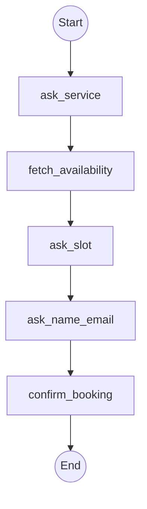

This page shows you how to **build a booking MCP app** with `@waniwani/sdk`. The user picks a service, the funnel checks availability, the user picks a slot, the funnel confirms. Runs as one MCP tool inside ChatGPT, Claude, or any MCP client.

## What you'll build

A booking flow that:

1. Asks **what service** they want (haircut, consultation, demo, etc.)
2. Calls your **availability API** (action node)
3. Asks the user to **pick a slot**
4. **Confirms the booking** with your backend
5. Returns a **booking reference**

## Flow graph



## Code

```ts
import { createFlow, START, END } from "@waniwani/sdk/mcp";
import { z } from "zod";
import { bookingApi } from "./booking-api";

export const bookingFunnel = createFlow({
  id: "booking",
  title: "Booking",
  description: "Use when the user wants to book a service. Collects service, slot, and contact info, then confirms the booking.",
  state: {
    service: z.string().describe("Which service the user wants to book"),
    availableSlots: z.array(z.string()).describe("ISO timestamps fetched from the API"),
    slot: z.string().describe("Chosen ISO timestamp"),
    name: z.string().describe("Full name"),
    email: z.string().describe("Email for the confirmation"),
    bookingRef: z.string().optional().describe("Booking reference (set on confirmation)"),
  },
})
  .addNode({
    id: "ask_service",
    label: "Pick a service",
    run: ({ interrupt }) =>
      interrupt({
        service: {
          question: "What would you like to book?",
          suggestions: ["Consultation", "Demo", "Onboarding session"],
        },
      }),
  })
  .addNode({
    id: "fetch_availability",
    label: "Fetch availability",
    hideFromFunnel: true,
    run: async ({ state }) => {
      const slots = await bookingApi.listAvailability(state.service);
      return { availableSlots: slots };
    },
  })
  .addNode({
    id: "ask_slot",
    label: "Pick a slot",
    run: ({ state, interrupt }) =>
      interrupt({
        slot: {
          question: "Pick a time that works for you.",
          suggestions: state.availableSlots,
          context: `Available slots (ISO timestamps): ${state.availableSlots.join(", ")}. Present these to the user in their local timezone in a friendly format. When they pick one, set slot to the matching ISO timestamp.`,
        },
      }),
  })
  .addNode({
    id: "ask_name_email",
    label: "Capture contact",
    run: ({ interrupt }) =>
      interrupt({
        name: { question: "Your name?" },
        email: { question: "And your email for the confirmation?" },
      }),
  })
  .addNode({
    id: "confirm_booking",
    label: "Confirm booking",
    run: async ({ state }) => {
      const booking = await bookingApi.create({
        service: state.service,
        slot: state.slot,
        name: state.name,
        email: state.email,
      });
      return { bookingRef: booking.ref };
    },
  })
  .addEdge(START, "ask_service")
  .addEdge("ask_service", "fetch_availability")
  .addEdge("fetch_availability", "ask_slot")
  .addEdge("ask_slot", "ask_name_email")
  .addEdge("ask_name_email", "confirm_booking")
  .addEdge("confirm_booking", END)
  .compile();
```

## Register

```ts
await bookingFunnel.register(server);
```

## Patterns this uses

- **Action nodes for API calls.** `fetch_availability` and `confirm_booking` run without user interaction. See [Flows → Nodes](/flows/nodes).
- **Suggestions passed at runtime.** `ask_slot` uses suggestions computed from `state.availableSlots`. See [Flows → Interrupts](/flows/interrupts).
- **Conditional re-asking.** Add a `validate` callback on `slot` to re-ask if the slot was taken between fetch and confirm.

## Variants

- **Recurring availability cache.** Skip the `fetch_availability` node by pre-loading slots and rotating them daily.
- **Multi-service with conditional branching.** Branch on `service` to ask different follow-up questions (e.g. "Bringing a guest?" only for consultations). See [Flows → Edges](/flows/edges).
- **Add a confirmation widget.** Use `showWidget` to display the booking card visually. See the [Pet Insurance Quote example](/guides/pet-insurance) for the widget handoff pattern.

## Add funnel analytics

Set `WANIWANI_API_KEY` and you'll see step-by-step drop-off using the node labels: **Pick a service → Pick a slot → Capture contact → Confirm booking**. `fetch_availability` is hidden from the funnel (`hideFromFunnel: true`) because it's plumbing, not a user-facing step. Helps you spot whether users abandon at slot selection or contact info. See [Tracking → Overview](/tracking/overview).

## Next

<CardGroup cols={2}>
  <Card title="Build a sales funnel MCP" icon="filter" href="/guides/sales-funnel" />
  <Card title="Build an insurance quote MCP" icon="shield" href="/guides/insurance-quote" />
  <Card title="Widgets in flows" icon="window-maximize" href="/guides/pet-insurance" />
  <Card title="Conditional edges" icon="code-branch" href="/flows/edges" />
</CardGroup>
